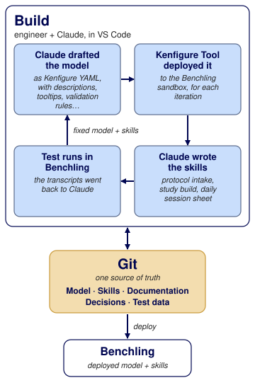

# Config as code turns AI into a solution builder

_A highly flexible in vivo study solution that scientists run with two simple prompts_

Ken Robbins, President, Go2 Software
{: .bt26-byline}

This is the online version of my Benchtalk 2026 poster. Questions? Email me at
[ken@go2.software](mailto:ken@go2.software).

## Problem

In vivo studies vary widely in experiment design, dosing regimens, in-life activities, sample
collection, welfare rules and assays. Together these produce many scheduled activities, samples
and results, often thousands for a single study.

A data model that supports this complexity and variety flexibly and robustly is itself complex.
The challenge then cascades: scientists need a practical, efficient way to register the study
design, execute the study and capture its results.

## Approach

My hub was an IDE with AI and git, like real software. Benchling was the target, not the place I
worked. The whole configuration (as Kenfigure™ YAML) and the skills lived together in git, where
the AI could read and change both. I built dramatically faster and cheaper, had much more control
of the AI, and still used Benchling AI (via MCP) and the Warehouse when needed. Kenfigure Tool™
deployed the entire model without thousands of UI clicks and keystrokes.

I guided each step and decision. AI handled the mechanics, test data, analysis, special cases and
blind spots.

## Build

{: .bt26-fig}

- From my requirements and sample protocol documents, Claude drafted the model as Kenfigure YAML.
  Kenfigure Tool deployed it, and every revision, directly to Benchling. The result was a far more
  robust model in a fraction of the time, with all revisions tracked in git.
- Claude wrote the skills using the model, documentation, test data and skill run transcripts. It
  used Benchling MCP to learn Benchling mechanics and Warehouse access to verify test results.
- Skill test runs tested both the skill and the model, and both were corrected as needed.

## Run

{: .bt26-fig}

- ***"Create study design from this doc."*** A skill reads the plain-language protocol and fills
  every registration table for the design. Nobody types the tables or works out the combinations
  by hand.
- **The scientist reviews and submits.** The skill never submits.
- ***"Set up study for today."*** A skill builds an entry with exactly the tables that day's work
  needs, already filled in. The scientist records the lab data and status.
- We still get the structured data. The scientists don't have to work hard to manage it.
- Dynamic entry creation avoids the need for a one-size-fits-all template, and the maintenance of
  it.

## The model

{: .bt26-fig}

Simplified: 11 of the 19 entity schemas. Result schemas and dropdowns are not shown.
{: .bt26-caption}

## What was built

- Adds 49 objects to an existing model: 19 entities, 8 result schemas, 22 dropdowns
- 159 fields, 57 links between schemas
- 5 skills and an in-entry study visualizer app
- About 2 weeks of effort

## What I learned

- **Easy to change direction.** A text model with automated deployment let me try things and back
  out, like infrastructure as code.
- **Real protocols drove the design.** They exposed use cases and caveats I would not have found
  until production.
- **The AI checked its own work.** It read Benchling chat transcripts and warehouse data to verify
  results and diagnose failures.
- **A skill replaces a static template.** It builds the entry, adds the structured tables needed,
  and fills them.

  
Built for

  
  
Thanks to the Resolution team for a hard problem, real protocols, and backing a new way of building.

## More about Kenfigure

- [Kenfigure](index.html): the open YAML spec for Benchling configurations
- [Kenfigure Tool user guide](kenfigure_tool_user_guide.html): converting a Benchling
  configuration to and from Kenfigure YAML
- [Kenfigure Pro](kenfigure_pro.html)
- [Benchling schema design style guide](schema_design_style_guide.html)

## Contact

Ken Robbins, President, Go2 Software

<a href="mailto:ken@go2.software" class="kf-cta-btn">ken@go2.software</a>

