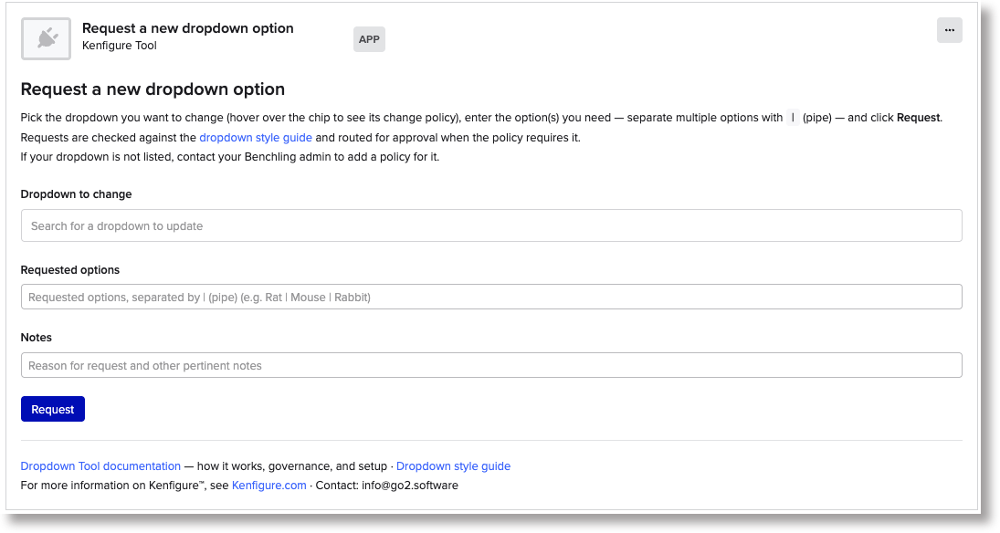
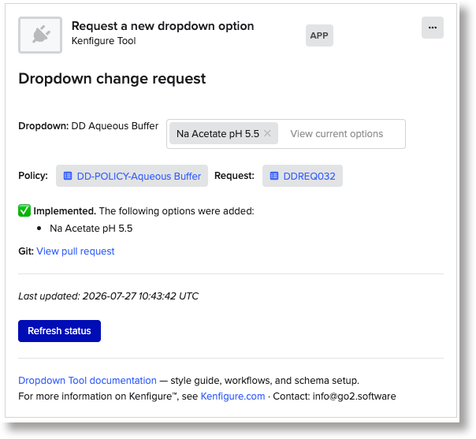

---

## title: Kenfigure Dropdown Tool

layout: default
toc: true

[Kenfigure home](https://kenfigure.com)

# Dropdown Tool

*A feature of Kenfigure Tool™, included with [Kenfigure Pro™](kenfigure_pro.html) · Go2 Software LLC*

Adding an option to a dropdown is a small change that only an administrator can make. That
combination makes it one of the most frequent requests Benchling admins receive — and one of
the most disruptive, because a scientist is usually blocked from recording data until it is done.

The Dropdown Tool lets scientists request options from inside the Notebook entry they are
already working in. Each request is checked against your style rules, routed for exactly as
much approval as that particular dropdown warrants, and — once approved — applied to the
dropdown and committed to your Git repository automatically.

Your controlled vocabularies stay controlled, and nobody has to interrupt an admin to add
"Rabbit" to a species list.

---


## How it works

1. **Request** — A scientist inserts the *Request a new dropdown option* canvas into a Notebook
  entry (or uses a sub-template that already contains it), picks the dropdown, and types the  option or options they need.
2. **Plan** — The request is checked against the [dropdown style
  guidance](schema_design_style_guide.html#dropdown-options) and against the *Style Guidance*
   configured for that specific dropdown. Duplicates and near-duplicates are dropped, non-ASCII
   characters and non-canonical forms are corrected, and oversized dropdowns are flagged.
3. **Confirm** — If anything was adjusted, the requestor reviews the proposed plan side by side
  with what they asked for, and accepts or cancels. If nothing was adjusted, this step is skipped.
4. **Approve** — Governed by the dropdown's policy. *Auto-approve* applies the change
  immediately; *Community* and *Community+Admin* email your named approvers a link to approve
   or reject. Approvers need no Kenfigure account and no new tool.
5. **Update** — Approved options are added to the dropdown (alphabetized if the policy says so).
  If you manage your Kenfigure configuration in Git, the dropdown's YAML file is updated and
   committed using your configured write strategy — a pull request is recommended.
6. **Notify** — The requestor and the dropdown's watchers are emailed when a change is proposed
  and again when it is resolved. Your administrators are notified of every outcome on every
   governed dropdown — including auto-approved changes — so nothing lands in your platform
   without their knowledge.

Every request is recorded as a registered **Dropdown Change Request** entity, so the full
history is searchable and auditable in Benchling itself.



---


## Governance that matches the risk

Not every dropdown needs the same level of control. A Vendors list changes often and carries
little risk. A Programs list changes rarely and matters a great deal. A Yes/No list should
probably never change at all.

Each governed dropdown gets its own **Dropdown Change Policy** entity, which defines how
requests against that dropdown are handled:


| Field                   | Required            | What it controls                                                                                                                                                      |
| ----------------------- | ------------------- | --------------------------------------------------------------------------------------------------------------------------------------------------------------------- |
| **Dropdown Name**       | Yes                 | The name of the Benchling dropdown this policy governs. Also generates the policy entity's own name.                                                                  |
| **Approval Type**       | Yes                 | `Auto-approve`, `Community`, or `Community+Admin`.                                                                                                                    |
| **Community Approvers** | For Community types | Comma-separated email addresses of people who may approve.                                                                                                            |
| **Min Approvers**       | For Community types | How many of those approvers must approve before the change is applied. Blank is treated as 1.                                                                         |
| **Watchers**            | No                  | Comma-separated email addresses notified when a change is proposed and when it is resolved.                                                                           |
| **Style Guidance**      | No                  | The canonical form for this dropdown — e.g. "Must conform to HUGO nomenclature", "Use Genus species format". Used by both the automated check and by human reviewers. |
| **Alphabetize**         | Yes                 | Whether the option list is kept sorted. When false, approved options are appended to the end and the existing order is never disturbed.                               |


**A dropdown with no policy cannot be requested against.** Only dropdowns that have a policy
entity appear in the scientist's picker. This is deliberate: it means you opt each dropdown
into the tool explicitly rather than exposing every controlled vocabulary in your tenant. If a
scientist needs a dropdown that is not listed, they contact a Benchling admin directly and you
add a policy for it or just make the change directly without using the Dropdown Tool.

Your administrators are always notified of outcomes, whatever the approval type — so an
`Auto-approve` policy is a decision to skip the *wait*, not a decision to skip the *oversight*.

---


## For scientists: making a request

1. Insert the *Request a new dropdown option* canvas
  via **Insert** > **Canvas** > **Request a new dropdown option**.
2. In **Dropdown to change**, search for and select the dropdown you want to add to. Hovering
  over the resulting chip shows that dropdown's change policy, including its approval rule and
   any style guidance.
3. In **Requested options**, type the option you need. To request several at once, separate them
  with a `|` (pipe) character — for example: `Rat | Mouse | Rabbit`.
4. In **Notes**, say why you need it. Approvers see this, and it becomes part of the permanent
  record of the request.
5. Click **Request**.

If your request needed no adjustment and the dropdown auto-approves, the option is usually
live within a few seconds. Otherwise you will see either a proposed plan to review or a status
page telling you who has been asked to approve.

The status page does not update by itself — approvals arrive by email, outside the canvas.
Click **Refresh status** to see where your request stands.

**If your dropdown is not in the list**, there is no policy for it yet. Contact your Benchling
administrator and ask them to add one or to make the change directly.



---


## Setup

Setup is a one-time task for a Benchling administrator. Until it is complete, the canvas shows
a "setup required" page instead of the request form.

### Step 1 — Create the schemas and dropdowns

The Dropdown Tool depends on two custom entity schemas and two dropdowns. **You create these,
not the app** — so you keep full control over their naming and their placement in your
organization.

Ready-to-import Kenfigure-format definitions are provided:

[Download the schema definitions (.zip) →](dropdown_tool_schemas/dropdown_tool_schemas.zip)

The fastest route is to run that zip straight through the tool you already have:

1. Download the zip above (do not unzip it).
2. In the Kenfigure Tool canvas, use **Import from File** to upload it. You will get a `.dat`
  file back.
3. In Benchling, go to **Settings** > **Configuration Migration**, click **Import**, and apply
  the `.dat`. All four objects are created in one migration.

If you would rather create them by hand in the Benchling admin console, the definitions are
also readable as individual YAML files —
[Dropdown Change Policy](dropdown_tool_schemas/Entity_schemas/Dropdown_Change_Policy.yaml),
[Dropdown Change Request](dropdown_tool_schemas/Entity_schemas/Dropdown_Change_Request.yaml),
[Dropdown Approval Types](dropdown_tool_schemas/Dropdowns/Dropdown_Approval_Types.yaml),
[Dropdown Update Statuses](dropdown_tool_schemas/Dropdowns/Dropdown_Update_Statuses.yaml)
— and the field lists are summarized below. Create the two dropdowns first; the schema fields
reference them.

If you routinely use Kenfigure Tool (Import) to update your Benchling configuration,
you can copy that above Kenfigure YAML files into your repository and use Kenfigure Tool
to import using your conventional Kenfigure change process.

**Dropdown Change Policy** (custom entity, prefix `DDPOL`) — the fields are listed in the
[governance table](#governance-that-matches-the-risk) above. Its name is generated from a name
template (`DD-POLICY-{Dropdown Name}`), so there is nothing to type for the entity name itself.

**Dropdown Change Request** (custom entity, prefix `DDREQ`) — the record of each request. The
tool populates every field; you never edit one by hand.


| Field               | Type                                  | Contents                                                                     |
| ------------------- | ------------------------------------- | ---------------------------------------------------------------------------- |
| Dropdown            | Entity link to Dropdown Change Policy | Which dropdown was requested                                                 |
| Requested Options   | Text                                  | What the scientist originally asked for                                      |
| Request Notes       | Text                                  | The scientist's stated reason                                                |
| Implemented Options | Text                                  | What was actually added                                                      |
| Status              | Dropdown (Dropdown Update Statuses)   | Pending, Approved, Rejected, or Implemented                                  |
| Status Details      | Long text                             | The full request ledger: the plan, each approval vote, and the event history |


**Dropdown Approval Types** (dropdown) — `Auto-approve`, `Community`, `Community+Admin`.
Referenced only by the policy schema, so you may name this dropdown anything you like.

**Dropdown Update Statuses** (dropdown) — `Pending`, `Approved`, `Rejected`, `Implemented`.

### Step 2 — Create one policy per governed dropdown

Add a **Dropdown Change Policy** entity for each dropdown you want scientists to be able to
request against. The only field you must fill in is **Dropdown Name** — set it to the exact
name of the target Benchling dropdown (e.g. `Species`).

Start with the dropdowns that generate the most requests. You can add more at any time, and a
dropdown with no policy is simply invisible to the tool.

> **Registering many policies at once?** If you are creating policies from a Notebook table,
> add a Boolean column named "Data Check" with a formula that returns an error message whenever
> a row is inconsistent. Benchling refuses to register a row when a Boolean column's formula
> evaluates to a non-blank string, so a bad row is blocked before it reaches your registry.
>
> Assuming `Approval Type` is in column E, `Community Approvers` in F, and `Min Approvers` in G
> (adjust the letters to match your table):
>
> ```
> =IF(AND(LEFT(E1,4)="Comm", ISBLANK(F1)),
>     "Community Approvers must be filled for this Approval Type",
>     IF(AND(E1="Community", ISBLANK(G1)),
>        "Min Approvers must be > 0 when Type is Community",
>        ""))
> ```
>
> This catches the two most common setup mistakes: a Community policy with nobody who can
> actually approve it, and a Community policy with no approval threshold. Write multi-line
> formulas like this in a text editor and paste them in — editing them inline is painful. Don't
> lock the column; let a user override it if the flagged row really is fine. The technique is
> general and works for any registration table: see [Reducing "garbage
> in"](https://medium.com/benchling-bistro/reducing-garbage-in-90c0e6f111f3) for the full pattern.

One convenient way to bulk create a set of policies is to use Benchling AI to create an entry with a **Dropdown Change Policy** registration table and a row for each dropdown.
You can ask the AI to suggest style guidance based on the existing options.
You can then review and adjust before registering your new policies.


### Step 3 — Name your administrators

Set `dropdown.admin_approvers` in the app's **Advanced Settings** (Connections > Apps >
Kenfigure Tool > CONFIGURATION) to a list of your registry administrators' email addresses:

```json
{
  "dropdown": {
    "admin_approvers": ["admin@yourcompany.com", "registry.admin@yourcompany.com"]
  }
}
```

This is **required** for any dropdown using the `Community+Admin` approval type, and
**recommended for every tenant**: these addresses receive the outcome notification for every
change to every governed dropdown, so your administrators always know what your platform now
contains — and can adjust or reverse an option if they disagree with it.

If a policy requires admin approval and no administrators are configured, requests against that
dropdown are parked with a status message explaining why.

### Step 4 — Confirm licensing

The Dropdown Tool is part of the Kenfigure Pro bundle and is enabled by default for Kenfigure
Pro subscribers. If the canvas shows an information page instead of the request form, see
[Feature enablement](feature_enablement.html) or [contact us](mailto:info@go2.software).

---


## Advanced Settings reference

All Dropdown Tool settings live under a `dropdown` block in Advanced Settings, alongside any
`git` block you already have. Git settings are documented in the
[Kenfigure Tool User Guide](kenfigure_tool_user_guide.html#advanced-settings).


| Setting                         | Required                                           | Description                                                                                                                                            |
| ------------------------------- | -------------------------------------------------- | ------------------------------------------------------------------------------------------------------------------------------------------------------ |
| `dropdown.admin_approvers`      | For `Community+Admin` policies; recommended always | Email addresses of your registry administrators. They approve `Community+Admin` requests and are notified of every outcome on every governed dropdown. |
| `dropdown.policy_schema_name`   | No                                                 | Set only if you renamed the Dropdown Change Policy schema beyond adding a prefix.                                                                          |
| `dropdown.request_schema_name`  | No                                                 | Set only if you renamed the Dropdown Change Request schema beyond adding a prefix.                                                                         |
| `dropdown.status_dropdown_name` | No                                                 | Set only if you renamed the Dropdown Update Statuses dropdown.                                                                                             |


A **prefix on the schema name works with no configuration at all** — `[Ops] Dropdown Change Policy` is found automatically, because the tool matches on the end of the name. You only need
the override settings if you changed the name itself.

A complete example combining Git and Dropdown Tool settings:

```json
{
  "git": {
    "repo_url": "https://github.com/yourorg/yourrepo.git",
    "path": "kenfigure",
    "branch": "main",
    "write_strategy": "branch_pr"
  },
  "dropdown": {
    "admin_approvers": ["admin@yourcompany.com"]
  }
}
```

---


## Approvals

When a policy requires approval, each named approver receives an email describing the request:
who asked, what they asked for, why, what the automated check proposed, and what the approval
rule is. The email carries **Approve** and **Reject** links.

- Approvers do not need a Kenfigure account, and do not need to open Benchling.
- Clicking a link opens a confirmation page; the decision is only recorded when the approver
confirms it there. (This deliberately guards against mail scanners that follow links
automatically.)
- Links are signed and expire.
- A single rejection ends the request. Approvals accumulate until the policy's threshold is met.

**Rejection is final for that request.** The requestor is emailed and told to discuss the
change and submit a revised request. Reviewers cannot edit a request in place — if the right
answer is a different option than the one asked for, reject with a suggestion and let the
requestor resubmit it. Administrators can of course always edit a dropdown directly in Benchling.

---


## Style rules

The automated check applies the dropdown guidance in the
**[Kenfigure schema design style guide](schema_design_style_guide.html#dropdown-options)** —
uniqueness (including semantic uniqueness), canonical forms, consistency with the existing
list, ASCII-only characters, no embedded commas, and a warning when a dropdown grows past
about a hundred options. That page is the single source for these rules; the tool enforces
them, and your reviewers can read them there.

Per-dropdown rules come from the policy's **Style Guidance** field, which is applied on top of
the general guidance.

Two passes run over every request. Deterministic checks — whitespace, duplicates, non-ASCII
characters, embedded commas, dropdown size — always run. An AI-assisted pass then proposes
canonical forms and catches semantic duplicates the deterministic pass cannot see. See our
[Security & Data Handling Overview](security_data_handling.html) for how request text is
processed.

Nothing is applied on the strength of the automated check alone — whenever it proposes a change
to what you typed, you see the before and after and decide whether to accept it.

> **Best practice:** if your Kenfigure dropdown YAML already carries style notes in its
> `Description` field, copy that text into the matching policy's Style Guidance. Keeping the two
> in sync means the automated curation and your own documentation always state the same rule.

---


## What this tool does not do

The Dropdown Tool curates **new incoming requests**. It is not a cleanup tool for what is
already in your tenant.

- It evaluates a request against **one dropdown's current option list** and that dropdown's own
Style Guidance. It never edits, renames, or archives options that are already registered —
including obvious typos already sitting in the dropdown.
- It never detects or merges **duplicate whole dropdowns** — for example, two separate Yes/No
dropdowns doing the same job under different names. That is a cross-dropdown governance
question, and the tool only ever looks at one dropdown at a time.
- It never reconciles the same real-world thing named differently **across different
dropdowns** — a vendor spelled one way in a Vendors dropdown and another way in a Suppliers
dropdown. Each dropdown is curated independently.

Existing-data cleanup of this kind is best handled as a one-time exercise, and
[Kenfigure Diagram](kenfigure_pro.html) with schema lint is a good place to start looking for it.

---


## Troubleshooting

**The canvas shows "Dropdown Tool setup required"**
One or more of the required schemas or dropdowns was not found on this tenant. The page lists
which. Create the missing objects ([Step 1](#step-1--create-the-schemas-and-dropdowns)), then
click **Check again**. If you created them under different names, set the override settings in
[Advanced Settings](#advanced-settings-reference).

**A newly added option shows as "undefined" in the canvas**
Benchling caches dropdown options in your browser and does not know about one created moments
ago. Reload the page and it appears correctly. The option was added successfully.

**The dropdown I need is not in the picker**
There is no Dropdown Change Policy for it. Ask a Benchling administrator to add one.

**My request has been pending for a while**
Approvals arrive by email and the canvas does not refresh itself. Click **Refresh status**. If
it is still pending, your approvers have not yet responded — the status page lists who was
asked.

**The change was approved but the option was not added**
The request stays at Approved with the error recorded in its Status Details, your
administrators are emailed, and we are alerted. An administrator can apply the option directly
in Benchling in the meantime.

---


## Licensing

The Dropdown Tool is part of **[Kenfigure Pro™](kenfigure_pro.html)** and is enabled by default
for Kenfigure Pro subscribers. When it is not licensed for a tenant, the canvas shows a link to
[Feature enablement](feature_enablement.html) rather than the request form.

Git commits of approved changes use your existing Kenfigure Tool Git configuration and require
the same write permissions as Export to Git — see the [Kenfigure Tool User
Guide](kenfigure_tool_user_guide.html#git-access-token). Git is optional; without it, approved
options are applied to Benchling only.

---


## Support

**Email:** [info@go2.software](mailto:info@go2.software)

**Related pages:** [Kenfigure Tool User Guide](kenfigure_tool_user_guide.html) ·
[Schema design style guide](schema_design_style_guide.html#dropdown-options) ·
[Kenfigure Pro](kenfigure_pro.html) · [FAQ](faq.html)

---

[Back to Kenfigure home](https://kenfigure.com)