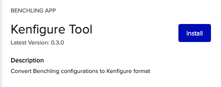
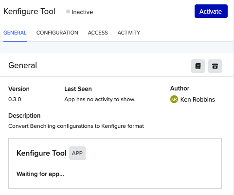
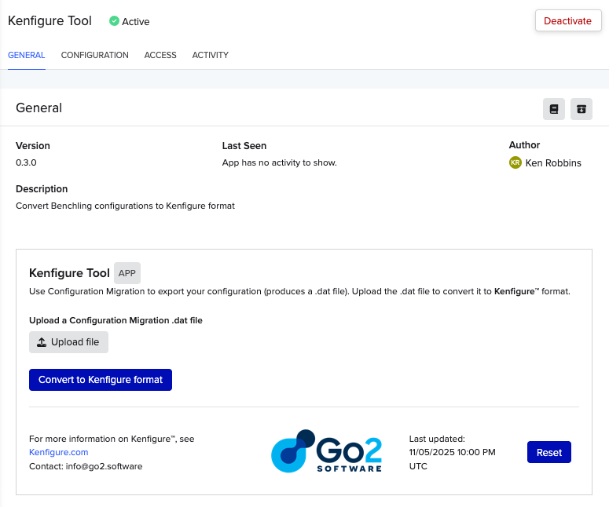
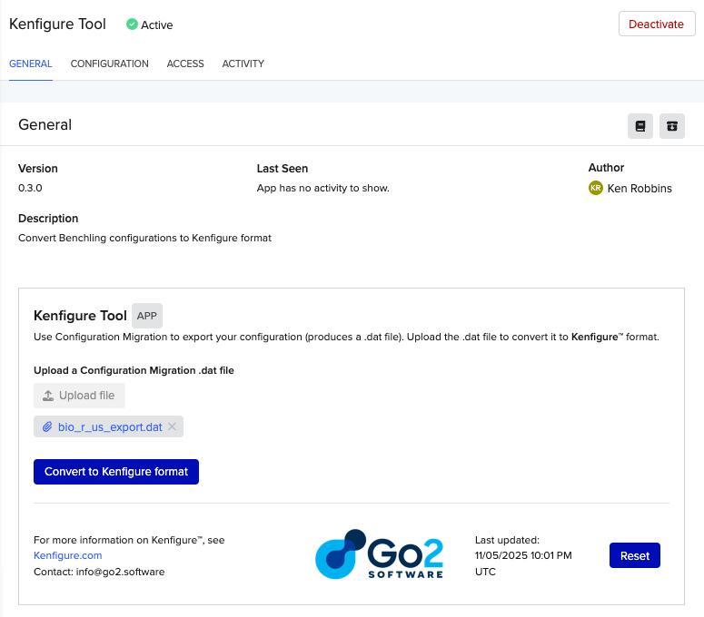
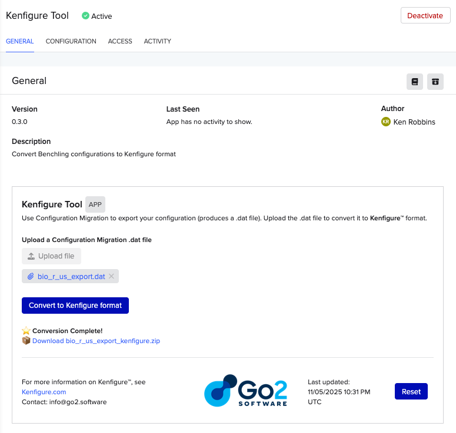

# Kenfigure Tool Export
Most Kenfigure use cases are based on existing Benchling deployments.
Therefore, we've created a tool that exports a current environment to Kenfigure format.
This is implemented as a public Canvas app that can be installed in any Benchling tenant.

The ability to automatically export your configuration to Kenfigure format serves the
following use cases.
- **Initial export** - To initialize your git repository with your current configuration
- **Change detection** - If you export on top of an existing git repo (main or feature branch)
  you will be able to see any drift in the actual environment compared to your source-of-truth
  repo. You can perform this process routinely or in an ad hoc fashion if you suspect there
  has been drift and want to resync. Of course if you find changes to the deployed environment
  that are not designed, you can then change Benchling to match.

## Beta status
Currently the app is in a closed beta. Please email info@go2.software to be added to the beta.
At the completion of the beta period, the app will be made as free and publicly available
Canvas app.

## Where to install
The app can be installed on any Benchling tenant. It does not need to be installed on the tenant
that is being converted. Therefore, a dev or test tenant is perfectly suitable.

## Installation
1. Send a request to access the beta to info@go2.software. Include the following:
   - Benchling tenant URL where you want to install the app (e.g., https://example.benchling.com)
   - If your tenant has an IP allowlist, provide the tenant_id. If you don't know this ID,
     just add a note and we'll tell you how to find it.
   - Your name
   - Company name
   - Type of tenant: Enterprise, Validated Cloud, Academic
2. We will add you to our beta allowlist and send back a unique URL that you can use to install the app
   on the specified tenant.
3. Open the provided URL to see the app installation screen in your Benchling tenant.
   
4. Click **Install**. You will see the following screen. This app in installed,
   but waiting to be activated.
   
6. Add the app to an Organization
   - Tenant admin > pick an Organization > Apps > search for Kenfigure Tool > Add App
   
7. Go back to App installation screen. If you need to reopen it you can use: Connections > Apps > Kenfigure Tool.
8. Click **Activate**. You will see the following screen:
   

## Usage
1. Using the **Configuration Migration** tool (Settings > Configuration migration), export your entire organization or a subset.
   There is no need to export Workflows or Templates since they are not yet supported by Kenfigure
   and will be ignored. It doesn't hurt to include them, but it may add time to the export, and Templates
   can make the export file size very large if you have many.
2. Navigate to the Kenfigure Tool app home page (Connections > Apps). See the image below to see the Connections icon.

   
3. Click the **Upload file** button and upload your exported .dat file from Configuration Migration.
   
4. Click the **Convert to Kenfigure format** button.
   
5. Click on the **Download `<export_name>_kenfigure.zip`** link to download the converted file
6. Unzip the file into a temporary directory or directly into your git repo (ideally after having created a branch).
   - The file unzips to a folder called `kenfigure_export`.
   - In addition to the Kenfigure format files, you will also see a file called `schema_lint_errors.log`.
     This is a text file that contains a list of "Schema Lint" warnings. These are based on an opinionated set of
     heuristics. Depending on your style some or many may not be relevant or important to you.
     Schema Lint generally implements the style guidance from [Schema Design Style Guide](./schema_design_style_guide.md).

## Data privacy
The app needs no special permissions other than being a member of an Organization.
It does not access and data or configuration on the tenant. The only data the app
has access to is the Configuration Migration file that you upload.
The uploaded configuration data is automatically purged after 7 days during the beta
period so that it is available for debugging if necessary.

The temporary configuration data is managed in a secured VPC on AWS infrastructure in the United States.
The data are encrypted at rest and there is no public access to the storage.
The converted output file is stored as a blob in your Benchling tenant. Downloading of this file
requires authenticated access to your environment.

## Disclaimers

**Beta Software**: The Kenfigure Tool is currently in beta and is provided "as is" without warranties of any kind, express or implied. Use of this tool is at your own risk.

**No Guarantees**: While we strive to provide accurate conversions, we do not guarantee that exported Kenfigure files will be error-free, complete, or suitable for your specific use case. Always review and validate exported configurations before relying on them for any purpose.

**Web-Based Service**: The Kenfigure Tool is a Benchling Canvas app - a web-based service that requires no software downloads or local installations.

**Service Availability**: We reserve the right to discontinue, suspend, or terminate access to the Kenfigure Tool at any time, for any reason, with or without notice. This includes the ability to revoke access for individual users or all users at our discretion.

**Limitation of Liability**: The developers and providers of this tool shall not be liable for any damages, losses, or issues arising from the use of this tool or the exported Kenfigure files, including but not limited to data loss or incorrect configurations.

**User Responsibility**: Users are responsible for backing up their data, validating exported configurations, and ensuring compliance with their organization's policies and requirements before using exported Kenfigure files for any purpose.
