[Kenfigure home](https://kenfigure.com)

# Kenfigure Tool User Guide

## What is Kenfigure Tool?

Kenfigure Tool is a Benchling Canvas app that converts your Benchling configuration between Benchling's native format and Kenfigure™ format. There's nothing to download or install on your computer — the tool runs entirely within Benchling as a canvas widget.

Kenfigure format is a human-readable text representation of your Benchling schemas and configuration. Storing your configuration in Kenfigure format means you can track it in a version control system (git), compare environments side by side, review changes before applying them, and use your configuration as context for AI tools.

**What you can do with Kenfigure Tool:**

- **Export your Benchling configuration** — Convert a Configuration Migration export file from Benchling into Kenfigure format. Use this to create an initial snapshot in your git repository, or to detect what has changed since your last export.
- **Import to Benchling** — Convert Kenfigure files back into a Configuration Migration import file, which you can then apply to any Benchling tenant. *(Premium feature — see [Licensing](#licensing).)*
- **Connect directly to your git repository** — In addition to downloading and managing files manually, Kenfigure Tool can also read from and write to your git repository. Exports can be committed directly to a branch, or submitted as a "pull request" (a proposed change ready for review) before being merged.

Every export you run also feeds [Kenfigure Diagram](#kenfigure-diagram), a companion product that renders your configuration as an interactive schema diagram.

---

## Access and Permissions

### What the app needs to run conversions

For day-to-day use, Kenfigure Tool only needs to be a member of your Benchling Organization. It does not read from your Benchling tenant, access your schemas directly, or require any elevated Benchling permissions to perform conversions. The only input to a conversion is the file you explicitly upload to the canvas.

Initial setup and configuration require a **Tenant Admin** role in Benchling, but this is a one-time step. Once installed and configured, any user with access to the app can run conversions.

### What users need

To run conversions, users need:

- Access to the Kenfigure Tool app in their Benchling Organization
- For the export workflow: access to Benchling's **Configuration Migration** tool (Settings > Configuration Migration)

### For git features

If you want Kenfigure Tool to read from or write to a git repository, you'll also need:

- A git repository accessible via an HTTPS URL (GitHub, GitLab, and Bitbucket are supported)
- A personal access token for that repository with appropriate permissions

See the [Git Access Token](#git-access-token) section for details on what permissions are required and how to generate a token.

Note: Bitbucket is supported for most git operations, but not for the pull request workflow. If you're using Bitbucket, use the direct commit write strategy.

### Kenfigure Diagram feature access

Kenfigure Diagram requires a separate login from Benchling. Access is provisioned per-tenant by Go2 Software — contact [info@go2.software](mailto:info@go2.software) to get users added.

Two roles are supported: **Read-only** (view diagrams, explore, and search) and **Editor** (also save layouts, groupings, and schema lint suppressions). A user does not need a Benchling login to use Kenfigure Diagram except for the Benchling AI chat interface inside Prompt Builder (which requires a Benchling OAuth connection).

The Kenfigure Diagram application does not need access to Benchling for nearly all features.
However, a few specific features pull live data from your Benchling tenant and need additional read access. If that access isn't available, only the affected feature is disabled; the rest of Kenfigure Diagram continues to work normally.

**Features that require read access to registry data:**

- **Entity counts** — Shows the number of entities of each schema type in the diagram
- **Open in Benchling search** — Clicking a displayed schema count opens a filtered search in your Benchling tenant
- **Open schema editor** — Clicking a schema menu option opens the schema configuration view in Benchling's admin settings

---

## Installation

### Standard installation

(See [Validated Cloud installation](#validated-cloud-installation) for Validated Cloud tenants.)

1. Make sure that you are logged into your Benchling tenant.
2. Browse to https://YOUR-TENANT.benchling.com/app-catalog/apps/appdef_xoILIM9FJI/install
3. You'll see the app installation screen.
  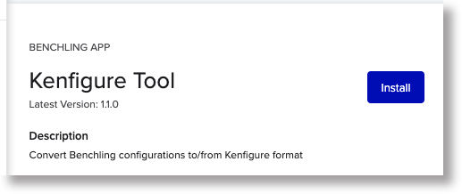
4. Click **Install**.
5. Hang on! Do NOT click **Create** yet.
6. **Before creating**, add the app to your Organization — this step must be done first or the canvas will not function:
  - Go to **Tenant Admin** > select your Organization > **Apps** > search for "Kenfigure Tool" > **Add App**
   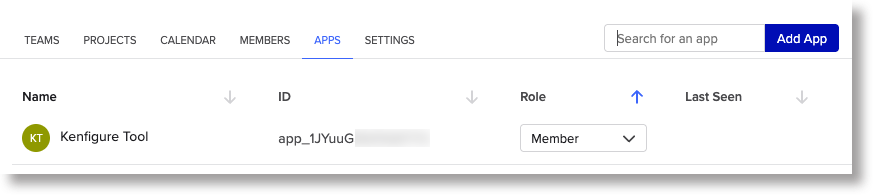
7. Return to the app screen (Connections > Apps > Kenfigure Tool if you navigated away) and click **Create**.
  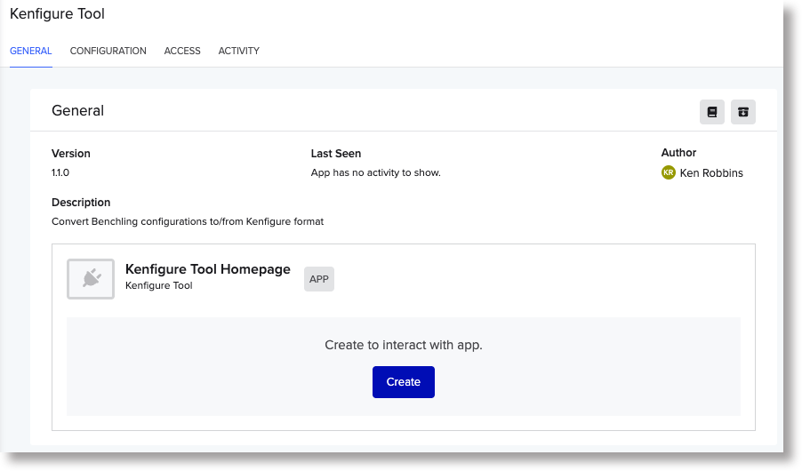

The app is now installed and ready to use!

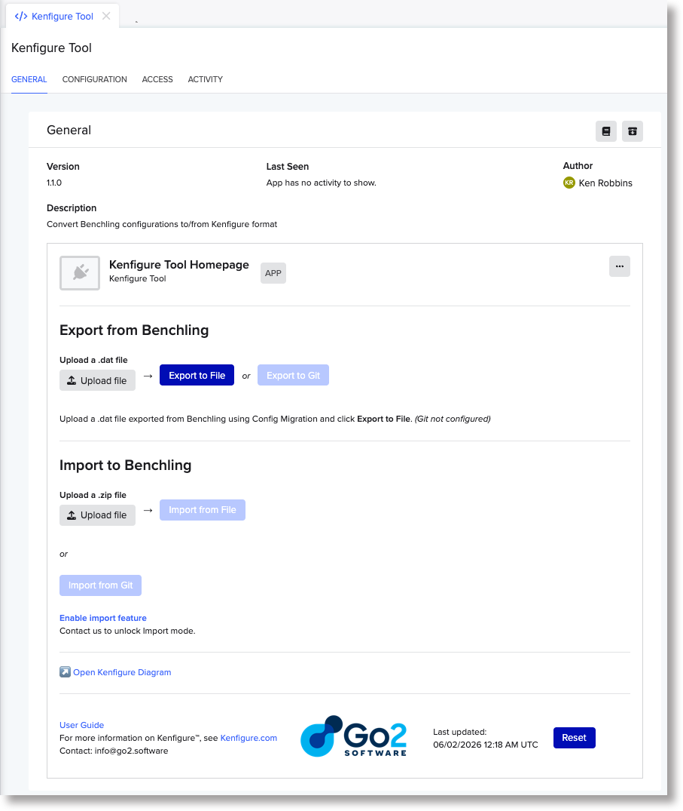

The **Export to git** button will be disabled until you configure a git repository (see [Configuration](#configuration)).

Contact [info@go2.sofware](mailto:info@go2.software) to upgrade to activate the **Import** buttons.

Repeat for each tenant on which you'd like to install Kenfigure Tool.

### Validated Cloud installation

For Benchling Validated Cloud tenants, the standard install URL process isn't available. Installation is done using an app manifest file that you can obtain from Go2 Software. Email [info@go2.software](mailto:info@go2.software) to get started.

---

## Upgrading

Upgrading a canvas app only refers to changing the Benchling configuration and metadata.
Therefore an app version upgrade might change what's available on the Configuration tab,
what events Benchling sends to the Kenfigure Tool service, or the app name or description.
An upgrade could also make available new canvases to insert into notebook entries.
Functional changes are independent of the canvas app version and do not require an upgrade
(like most Software-as-a-Service services).

### Standard upgrade

If an app version upgrade is required (not a common event) you simply open the URL
that you used to install the app. Instead of an **Install** button, you'll see
an **Upgrade** button. You will not need to add the app the the organization since that only
needs to be done once. If an upgrade is available, we'll communicate that through
the email.

### Validated Cloud

Because each new Validated Cloud version is a fresh installation, upgrading involves:

1. Install the new version from the updated manifest file (provided by Go2 Software)
2. Add the app to your Organization
3. Re-apply your **Advanced Settings** configuration
4. Re-enter your **Git Access Token**
  You can't read the old token back from the previous installation, so have it ready in a password manager before you start. If you don't have it, generate a new one from your git provider and update whatever systems reference it.
5. Archive the old app version in Benchling

---

## Configuration

Kenfigure Tool configuration is managed by a Tenant Admin via the **CONFIGURATION** tab on the app's Home page (Connections > Apps > Kenfigure Tool > CONFIGURATION).

There are two configuration items: **Advanced Settings**, which controls git integration, and **Git Access Token**, which provides the credential for git operations. Both are needed only if you're using git features — file-based exports and imports work with no configuration at all.

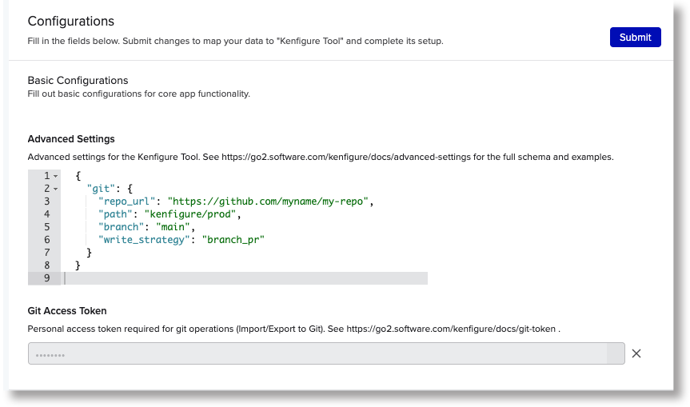

### Advanced Settings

Advanced Settings is a block of JSON (a structured text format) that tells Kenfigure Tool how to connect to your git repository. If you're only using file-based operations, skip this section.

When Advanced Settings is absent or contains invalid JSON, the git buttons on the canvas are disabled.

The configuration uses the following fields inside a `git` block:


| Field            | Required | Default       | Description                                                                                                                                                                                         |
| ---------------- | -------- | ------------- | --------------------------------------------------------------------------------------------------------------------------------------------------------------------------------------------------- |
| `repo_url`       | Yes      | —             | The HTTPS URL of your git repository. SSH URLs are not supported.                                                                                                                                   |
| `path`           | No       | *(repo root)* | A subfolder within the repository where your Kenfigure files live.                                                                                                                                  |
| `branch`         | No       | `main`        | The branch to read from and write to.                                                                                                                                                               |
| `write_strategy` | No       | `direct`      | How exports are written back to the repo: `direct` commits to the branch immediately; `branch_pr` creates a new branch and opens a pull request for review. GitHub and GitLab only for `branch_pr`. |


**Minimal example** — uses the root of the repository, default branch:

```json
{
  "git": {
    "repo_url": "https://github.com/yourorg/yourrepo.git"
  }
}
```

**With a subfolder and specific branch:**

```json
{
  "git": {
    "repo_url": "https://github.com/yourorg/yourrepo.git",
    "path": "kenfigure",
    "branch": "main"
  }
}
```

**Using pull requests for exports (GitHub or GitLab only):**

```json
{
  "git": {
    "repo_url": "https://github.com/yourorg/yourrepo.git",
    "path": "kenfigure",
    "branch": "main",
    "write_strategy": "branch_pr"
  }
}
```

With `branch_pr`, each export creates a new branch and opens a pull request targeting your configured branch. This lets someone review the changes before merging. If nothing changed since the last export, the app detects this and skips creating a branch or pull request. Reviewing a pull request is an excellent way to review changes to the Benchling environment since the last export
or to verify that nothing has changed.

### Git Access Token

The Git Access Token is the credential Kenfigure Tool uses to read from and write to your repository during conversions. It is stored using Benchling's encrypted secure configuration — the token is never visible after you save it.

When this item isn't set, the git buttons appear on the canvas but are disabled with a warning. File-based exports and imports continue to work normally.

#### Required permissions

The permissions your token needs depend on what you want to do:


| Operation                     | Permissions needed                                                  |
| ----------------------------- | ------------------------------------------------------------------- |
| Import from Git               | Contents: Read, Metadata: Read                                      |
| Export to Git (direct commit) | Contents: Read + Write, Metadata: Read                              |
| Export to Git (pull request)  | Contents: Read + Write, Metadata: Read, Pull requests: Read + Write |


#### Generating a token

The following provides convenience guides for generating git access tokens.
The specific menu structure is subject to change. Check your git provider's
documentation for definitive instructions.

**GitHub — fine-grained personal access token:**

1. Go to GitHub > **Settings** > **Developer settings** > **Personal access tokens** > **Fine-grained tokens**
2. Click **Generate new token**
3. Give it a name and set an expiration
4. Under **Repository access**, select the repository you're connecting to (recommended), or choose all repositories if your policy allows it
5. Under **Permissions**, grant the permissions from the table above for the operations you'll use
6. Click **Generate token** — copy the value immediately, as you won't be able to see it again

**GitLab:**

1. Navigate to your project and go to **Settings** > **Access Tokens**
2. Click **Add a new token**
3. Give it a name and set an expiration
4. Select the **read_repository** scope (and **write_repository** if you'll be exporting to Git)
5. Click **Create project access token** — copy the value immediately, as you won't be able to see it again

**Bitbucket:**

Bitbucket uses "App passwords" for git access over HTTPS.

1. Log in to Bitbucket, click your avatar in the bottom-left corner, and select **Personal settings**
2. In the left sidebar, click **App passwords** (under Security)
3. Click **Create app password**
4. Give it a label
5. Under **Repositories**, select **Read** (and **Write** if you'll be exporting to Git)
6. Click **Create** — copy the value immediately, as you won't be able to see it again

When using an App password, your git repository URL must include your Bitbucket username
(e.g., `https://yourusername@bitbucket.org/yourworkspace/yourrepo.git`).

#### Entering your token

Go to **CONFIGURATION** > **Git Access Token** > paste your token value > Submit.

---

## Usage

### Home page

Open the app via **Connections** (the icon that looks like a folder with a recycling symbol at the bottom of the Benchling navigation bar) > **Apps** > **Kenfigure Tool**.

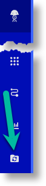

The Home page has four tabs:

- **GENERAL** — The main conversion canvas. This is identical to the canvas you get when inserting Kenfigure Tool into a Notebook entry — use whichever is more convenient.
- **CONFIGURATION** — Where a Tenant Admin sets up Advanced Settings and the Git Access Token.
- **ACCESS** — Shows the access granted to the app
- **ACTIVITY** — The conversion activity log (see [Activity Log](#activity-log)).

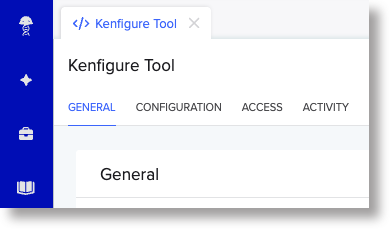

### Inserting the canvas into a Notebook entry

You can run conversions directly inside any Notebook entry:

1. Open or create a Notebook entry
2. Click **Insert** > **Canvas** > **Convert to/from Kenfigure Format** > **Insert**

The canvas that appears is identical to the GENERAL tab on the Home page.

### Canvas layout

The canvas has an Export section, Import section, and some useful references at the bottom.

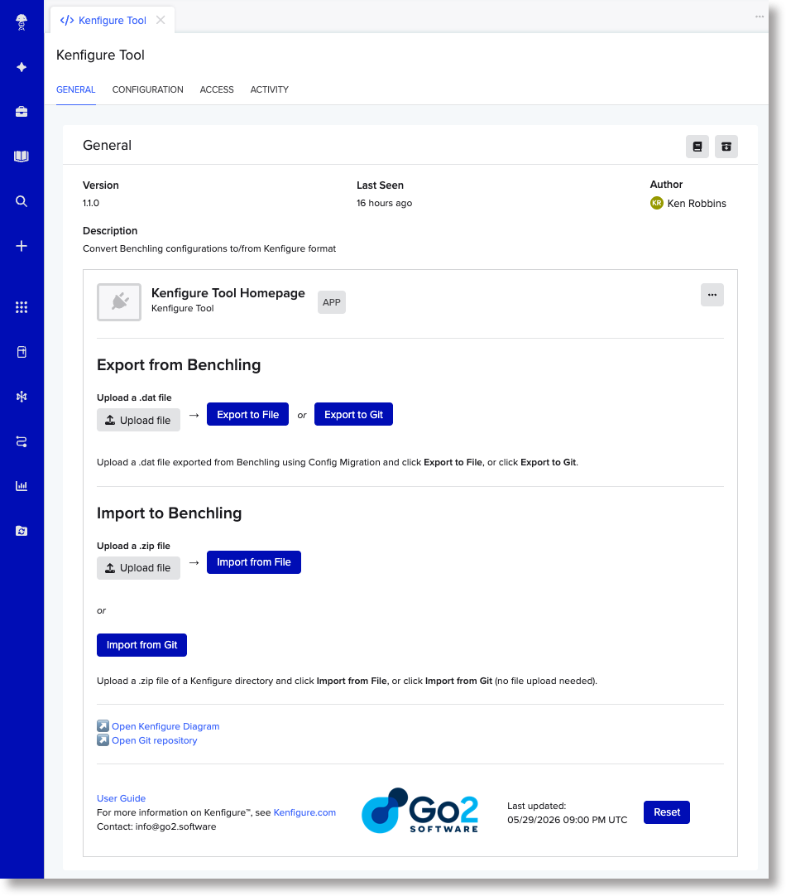

**Export from Benchling** (top section)

Upload a `.dat` file exported from Benchling using the Configuration Migration tool, then choose where to send the converted output:

- **Export to File** — converts and gives you a downloadable `.zip` file
- **Export to Git** — converts and writes directly to your git repository

**Import to Benchling** (bottom section)

Provide Kenfigure files and convert them back to a Benchling-ready file:

- **Import from File** — upload a `.zip` file of Kenfigure files; converts and delivers a downloadable `.dat` file
- **Import from Git** — no file upload needed; the app fetches files from your repository and delivers a downloadable `.dat` file

The git buttons appear in both sections. If git is not configured or the access token is missing, they are present but grayed out, with a note explaining why.

Below the Import section you'll find links to **Open Kenfigure Diagram** and **Open Git repository** (if git is configured).

The footer contains a link to this User Guide, a link to Kenfigure.com, a version timestamp, and a **Reset** button.

### Export workflow: Benchling → Kenfigure

#### Step 1 — Create a Configuration Migration export from Benchling

Before using Kenfigure Tool, export your Benchling configuration using the Configuration Migration tool:

1. In Benchling, go to **Settings** > **Configuration Migration**
2. Select the Organization (if you have more than one)
3. Select "Select items to migrate" or "Migrate entire org". We recommend that you use "Select items to migrate" and then select all schemas and dropdowns (see tip below)
4. Click **Export**. Benchling generates and downloads a `.dat` file to your computer.

Tip: you don't need to include Workflows or Templates. Kenfigure doesn't support those yet, and including them — especially Templates — can make the file very large and will slow things down.

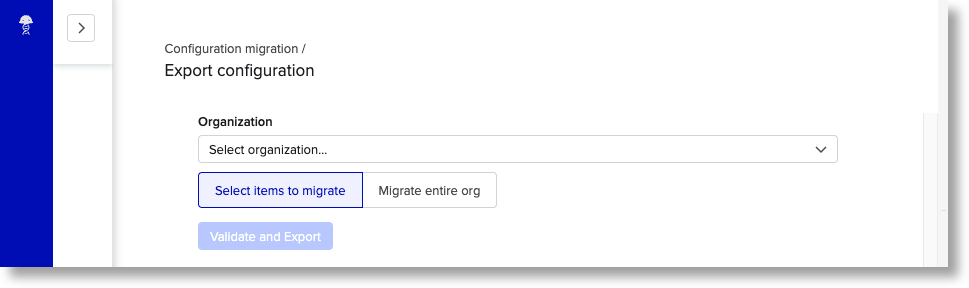

#### Step 2 — Upload the .dat file to the Kenfigure Tool canvas

In the **Export from Benchling** section at the top of the canvas, click the "Upload file" and select your `.dat` file.

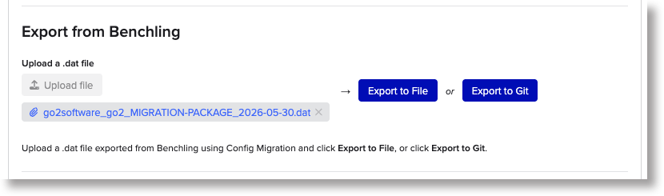

#### Step 3a — Export to File

Click **Export to File**. This button converts the uploaded file to Kenfigure format and outputs that as a zipped file.
The status area will briefly show a "Converting…" message, then after a few seconds to about a minute a download link will appear.

Click the link to download the `.zip` file.

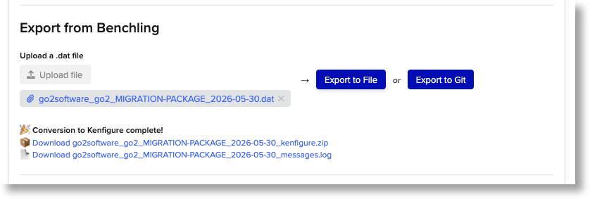

The `.zip` contains your Kenfigure files organized by schema type. It also includes a file called `schema_lint_errors.log`, which contains style suggestions based on Kenfigure's schema design guidelines. These are optional recommendations — review them at your discretion and act on whatever makes sense for your team.
(Kenfigure Diagram allows you to view your schema lint warnings interactively and in context and provides a means to suppress individual warnings.)

#### Step 3b — Export to Git

Click **Export to Git**. This button converts the uploaded file to Kenfigure format and sends the resulting files directly to your configured git repository.

- With the **direct** write strategy (default), changes are committed directly to your configured branch. A link to the repository appears in the status area when it's done.
- With the **branch_pr** (branch and pull request) strategy, a new branch is created and a pull request is opened targeting your configured branch.
  A link to the pull request appears in the status area.

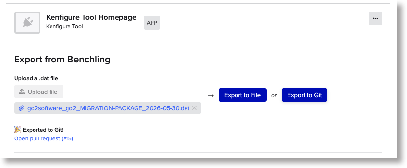

### Export dashboards workflow: Benchling → Kenfigure

This workflow exports all Benchling Insights Dashboards in your tenant directly to Kenfigure format.
No `.dat` file upload is needed — the app pulls dashboard data from Benchling automatically.

#### Step 1 — Click Export Dashboards to File *or* Export Dashboards to Git

In the **Export from Benchling** section, locate the **Export Dashboards to File** and **Export Dashboards to Git** buttons.

- **Export Dashboards to File**: fetches all dashboards and outputs a `.zip` file for download.
  Click the download link that appears in the status area when it's done.
- **Export Dashboards to Git**: fetches all dashboards and commits the resulting files directly to
  your configured git repository. A link to the repository or pull request appears when done.

#### Output structure

Dashboards are written under a `Dashboards/` directory at the same level as `Entity_schemas/`,
`Dropdowns/`, etc. Each dashboard gets its own sub-directory named after the dashboard
(with spaces replaced by underscores). Inside each directory:

- `<Dashboard_Name>.yaml` — dashboard metadata (name, project, description) and block list,
  with each block's `SQL` key referencing its `.sql` file
- `<Block_Name>.sql` — one file per SQL block, for easy editing, review, and AI assistance

Example:

```
Dashboards/
  Sequence_QC_Summary/
    Sequence_QC_Summary.yaml
    Entity_Count_by_Project.sql
    Failed_QC_Lots.sql
  Lot_Release_Results/
    Lot_Release_Results.yaml
    Lot_Summary.sql
```

> **Note:** Dashboard Parameters and Chart configuration are defined in the Kenfigure schema
> for forward-compatibility, but are not populated by export because Benchling does not currently
> expose those fields via the API. You can add them by hand after export.

### Import workflow: Kenfigure → Benchling

> **Note:** Import is a premium feature. If the Import buttons are disabled, contact [info@go2.software](mailto:info@go2.software) to get it enabled for your tenant.

#### Option A — Import from File

1. In the **Import to Benchling** section, click the upload area and select a `.zip` file containing your Kenfigure files
2. Click **Import from File**
3. When the conversion finishes, a download link appears — click it to download the `.dat` file

#### Option B — Import from Git

No file upload is needed.

1. Click **Import from Git**
2. The app fetches the Kenfigure files from your configured repository and converts them to Benchling format
3. A download link appears — click it to download the `.dat` file

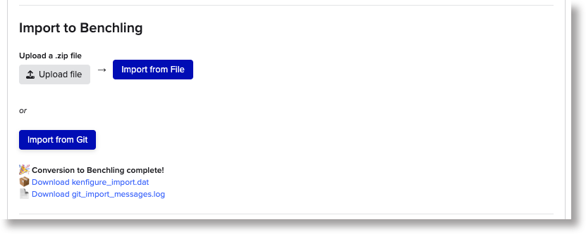

#### Applying the .dat file to Benchling

Once you have a `.dat` file from either option above:

1. In Benchling, go to **Settings** > **Configuration Migration**
2. Click **Import** and upload your `.dat` file
3. Follow the Configuration Migration prompts to complete the import into your tenant

### Status messages and timing

Each section — Export and Import — has its own status area below the buttons.

After clicking a button, it usually takes a few seconds before the status clears the old status and
provides its first update.

Conversions themselves can take from a few seconds up to about a minute, depending on the size and complexity of your configuration.

If a conversion fails, a downloadable `.log` file appears instead of the usual output. Download it to see the error details.

### Resetting the canvas

Click **Reset** in the footer to clear any uploaded files and return both sections to their idle state.

If the canvas appears stuck and the Reset button doesn't help, use Benchling's built-in hard reset: click the **ellipsis (⋯) menu** in the canvas toolbar and select **Reset Canvas**. This is a more complete reset and should resolve most stuck states.

---

## Activity Log

Kenfigure Tool records every conversion attempt in an activity log. To view it, open the **ACTIVITY** tab on the app's Home page (Connections > Apps > Kenfigure Tool > ACTIVITY).

Each entry shows the operation name, timestamp, and whether it succeeded or failed. Click the **triangle (▶)** next to any entry to expand it and see the full detail — including what file was converted, how long it took, and the specific error if something went wrong.

It takes a few seconds after opening the ACTIVITY tab for the most recent entry to appear.

The log messages in an expanded session are ordered with the most recent at the top.

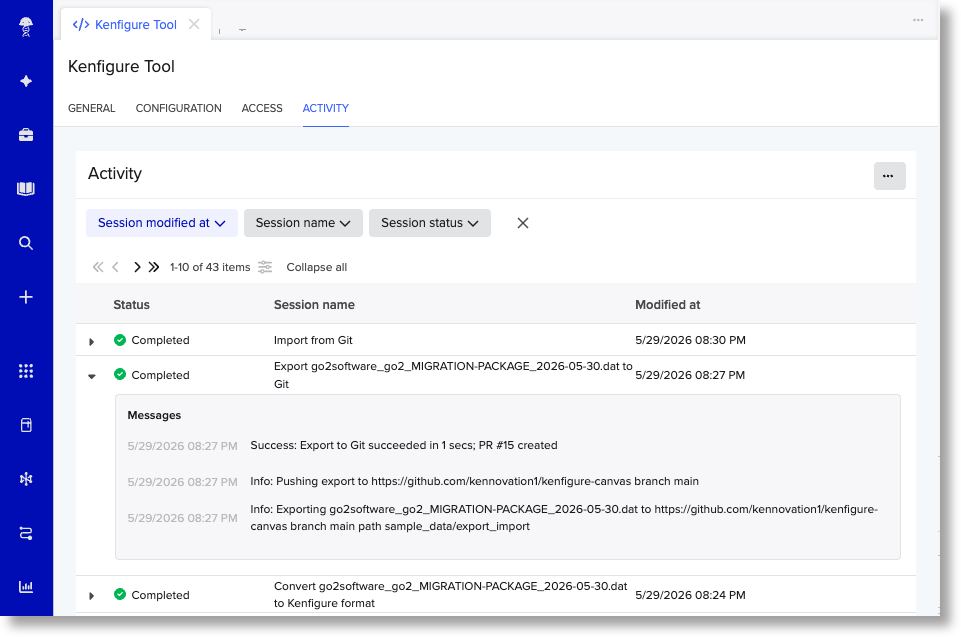

---

## Kenfigure Diagram

Every export you run through Kenfigure Tool also makes your configuration immediately available in Kenfigure Diagram.

Kenfigure Diagram is a licensed companion product that renders your Kenfigure configuration as an interactive schema diagram — a fast way to explore the structure of your Benchling environment, share it with your team, and find relationships that are hard to see in a list. If your tenant is provisioned for Kenfigure Diagram, the canvas shows an **Open Kenfigure Diagram** link that takes you directly to your tenant's view.

Contact [info@go2.software](mailto:info@go2.software) to learn more or to get Kenfigure Diagram set up for your tenant.

---

## Licensing

| Feature                   | Availability |
| ------------------------- | ------------ |
| Export to File            | Free for all users |
| Export to Git             | Free for all users |
| Import from File          | Premium — see [Feature enablement](https://kenfigure.com/feature_enablement.html) |
| Import from Git           | Premium — see [Feature enablement](https://kenfigure.com/feature_enablement.html) |
| Kenfigure Diagram         | Premium — see [Feature enablement](https://kenfigure.com/feature_enablement.html) |

When a premium feature is not licensed for your tenant, the relevant button in the canvas is disabled and shows a link to the [feature enablement page](https://kenfigure.com/feature_enablement.html) with instructions on how to request access. There is no error message — the canvas simply presents the features that are available.

If the Import buttons are visible but disabled, your tenant has not been provisioned for Import mode. See [Feature enablement](https://kenfigure.com/feature_enablement.html) to request access.


---

## Data Privacy and Security

Kenfigure Tool does not read from your Benchling tenant. It only processes the files you explicitly upload to the canvas. Benchling's Configuration Migration files contain schema configuration and dropdown values — no scientific or experimental data.

Uploaded files and converted outputs are processed and stored on encrypted AWS infrastructure in the United States, within a secured private network. The converted output is also stored as a blob in your Benchling tenant, where it can only be accessed by authenticated users with appropriate access. No configuration data is shared with third parties or outside your organization's context.

---

## Troubleshooting

**Git buttons are grayed out with no warning**
Advanced Settings is missing, contains invalid JSON, or the `repo_url` field is blank. Open the CONFIGURATION tab to add or correct the Advanced Settings value.

**Git buttons are grayed out with a warning message**
The Git Access Token hasn't been set. Open the CONFIGURATION tab and enter your token in the Git Access Token field.

**GitHub error: "Write access to repository not granted"**
Your token doesn't have access to the target repository. Add the repository to your fine-grained PAT's repository access list and try again. Note that this error can appear even for read-only operations — GitHub's error message is misleading in that case.

**The canvas shows "Converting…" and never updates**
Wait up to about a minute (longer for very complex configurations). If the status still hasn't updated, click the **ellipsis (⋯) menu** in the canvas toolbar and select **Reset Canvas**, then check the ACTIVITY tab for error details.

**The conversion produced a .log file instead of a .zip or .dat**
The conversion failed. Download the `.log` file and review it for details. Common causes include a schema validation error in your Kenfigure files.
It's helpful to configure your IDE with the Kenfigure JSON schema so that your IDE informs you of syntax errors. See [kenfigure.com](https://kenfigure.com) for details.
If the error isn't clear, send the log to [info@go2.software](mailto:info@go2.software) and we'll help.

---

## Support

**Email:** [info@go2.software](mailto:info@go2.software)

**Documentation and updates:** [kenfigure.com](https://kenfigure.com)

---

## Disclaimers

**No warranties:** Kenfigure Tool is provided "as is" without warranties of any kind, express or implied. Use of this tool is at your own risk.

**No guarantees:** While we work hard to ensure accurate conversions, we do not guarantee that exported or imported files will be error-free, complete, or suitable for your specific use case. Always review converted configurations before applying them to a production environment.

**Service availability:** We reserve the right to modify, suspend, or discontinue access to Kenfigure Tool at any time, for any reason, with or without notice. This includes the ability to change access for individual users or all users at our discretion.

**Limitation of liability:** The developers and providers of this tool are not liable for any damages, losses, or issues arising from its use, including but not limited to data loss or incorrect configurations.

**User responsibility:** Users are responsible for validating exported and imported configurations and for ensuring compliance with their organization's policies and procedures.

---

[Back to Kenfigure home](https://kenfigure.com) · [Feature enablement](https://kenfigure.com/feature_enablement.html)

**Kenfigure™** and **Kenfiguration™** are trademarks of Go2 Software LLC.
Use of the names "Kenfigure" or "Kenfiguration" in derivative projects or commercial products is not permitted without permission.

Benchling is a trademark of Benchling, Inc.

© 2026 Go2 Software LLC. All rights reserved.